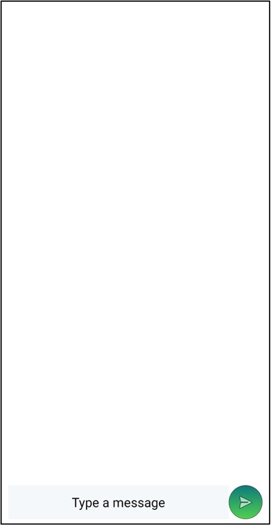

#  &nbsp; Viibez - A Messaging App -

This project was built keeping communication in mind. It is a simple android messaging app. The IDE used was Android Studio and the language used was Java. Google’s Firebase was used as a backend platform. The high fidelity design of the app was built using Adobe XD. Apart from GitHub, one can also access this app on Google’s Play Store [here](https://play.google.com/store/apps/details?id=com.dbc.viibez_messagingapp). This project was build as a part of Android App Development course provided by the startup company Golden Bird Learning Pvt. Ltd. It was used to teach engineering undergraduate students how to build a fully functional android messaging application with multiple screens. It also provided a good source of learning for integrating Firebase as the backend for any android application. It has all the features of a traditional messaging application barring private chatrooms for one-to-one conversation i.e., all the messages sent on the app, can be read by all the users who have signed up to this application. Hence, it taught students how to build their own versions of this app that could be a good platform for instant communication among a small group of individuals such as family members, group of friends, colleagues, etc.

## App Images -

 &nbsp; &nbsp;
 
 &nbsp; &nbsp;
 
 

 

# 